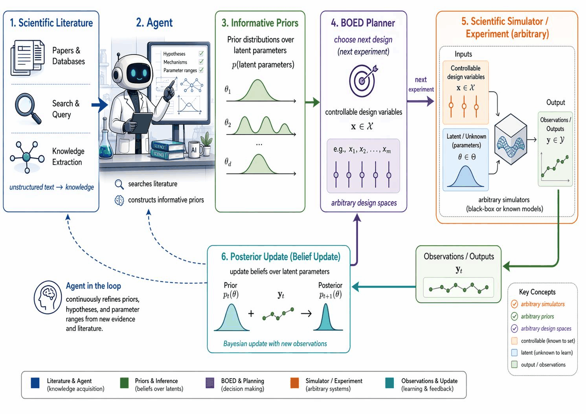
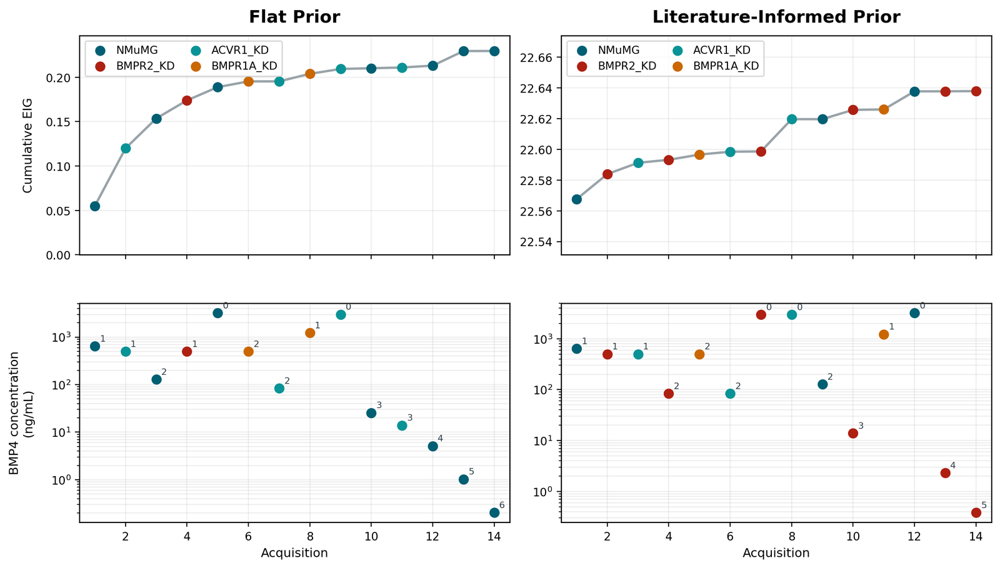
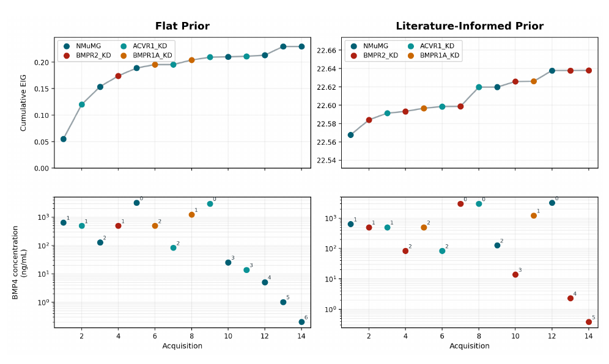

# Figures

Main-text figures from **MetaBOED: Agentic Control of Inference and Experimental Design under
Simulator Uncertainty**, with short captions.

### Figure 1 — BOED-Agent workflow

A problem bundle is parsed, enriched with literature-informed priors, dispatched to a backend,
and run in a sequential design loop.

### Figure 2 — Interactive pipeline

The interactive pipeline that wraps every run. A sparse problem bundle is normalized into an
executable `ExperimentSpec`; missing fields trigger numbered clarification turns;
literature-informed priors and a backend routing decision are dispatched into the chosen BOED
estimator, with reasoning traces and run artifacts written back to disk for audit.

### Figure 3 — Flat vs. literature-informed prior

EIG optimization under a flat, uninformative prior versus one based on agentic literature review.
Both reach comparable total EIG within a small budget, but the literature-informed run chooses a
more diverse set of cell-line and BMP4-dose experiments.
